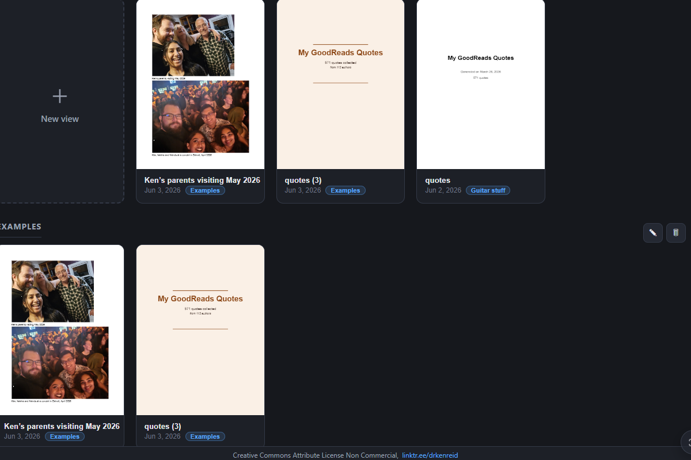
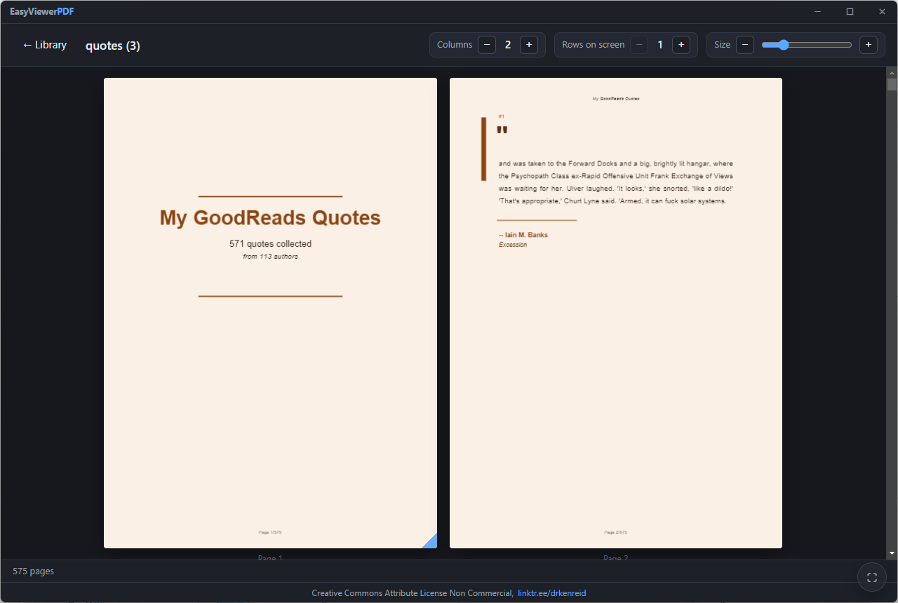

# EasyViewerPDF

EasyViewerPDF is a desktop app for keeping PDFs organized and easy to read.
You add a PDF once, and the app stores its own copy so the file keeps working
even if you move or rename the original.

## What it does

- Opens a PDF and shows its pages in a flexible grid.
- Keeps a library of saved PDFs so you can return to them later.
- Lets you sort PDFs into categories.
- Lets you resize pages and adjust the layout.
- Works in dark mode and supports keyboard shortcuts.

## Screenshots

Real app screenshots using:
- `quotes (3).pdf`
- `Ken’s parents visiting May 2026.pdf`

Library view:



Viewer mode:



## How to use it

1. Start the app.
2. Click the `+` tile to add one or more PDFs.
3. Pick a file, or drag PDFs from File Explorer into a category.
4. Click a saved PDF to open it.
5. Use categories, search, and sort to keep your library tidy.

## Helpful things to know

- The app copies your PDF into its own storage folder. Your original file is
  left alone.
- You can add many PDFs at once by selecting several files.
- You can also drag PDFs from File Explorer into a category to import them
  there immediately.
- Right-click a PDF in the library or viewer to copy or reveal its stored path.
- `F11` enters fullscreen and `Esc` exits fullscreen when no dialog is open.

## Install and run

### If you just want to try it

Download the Windows installer from the GitHub Releases page, then run the
`.exe` file.

### If you want to run from source

```powershell
npm install
npm start
```

## Windows installer builds

```powershell
npm install
npm run dist:win
```

The installer is written to `dist/` as a setup `.exe` file.

## Where your PDFs are stored

EasyViewerPDF stores its library in your per-user app data folder.

```
<userData>/library/<viewId>/
  source.pdf   # the copied PDF
  view.json    # name, category, and layout settings
```

Use **Open storage folder** from the library menu to open that location.
On Windows, it is usually under your `%APPDATA%` folder.

## Features for power users

- Search by name or category.
- Filter by category.
- Sort by newest, oldest, name, or category.
- Rename or delete categories directly from the library.
- Multi-select PDFs for bulk move, category removal, or delete.
- Copy the stored PDF path from the context menu.
- Import multiple PDFs from File Explorer by dragging them into the library.

## Technical details

EasyViewerPDF is built with Electron and [pdf.js](https://mozilla.github.io/pdf.js/).
The code is split into a main process, a secure preload bridge, and renderer
modules for the library and viewer screens.

## Project layout

| File | Responsibility |
|------|----------------|
| `main.js` | Electron main process + file-system backed library (IPC). |
| `preload.js` | Secure `window.api` bridge. |
| `renderer/app.js` | Routing between library and viewer. |
| `renderer/library.js` | Library screen, search, categories, and thumbnails. |
| `renderer/viewer.js` | Page grid, resizing, and layout controls. |
| `renderer/pdfutil.js` | pdf.js wrapper (load + render page). |
| `renderer/ui.js` | Accessible modal confirm/prompt dialogs. |
| `renderer/dom.js` | Small DOM helpers. |
| `renderer/styles.css` | Dark, accessible theme. |

## License

Creative Commons Attribute License Non Commercial.

linktr.ee/drkenreid
